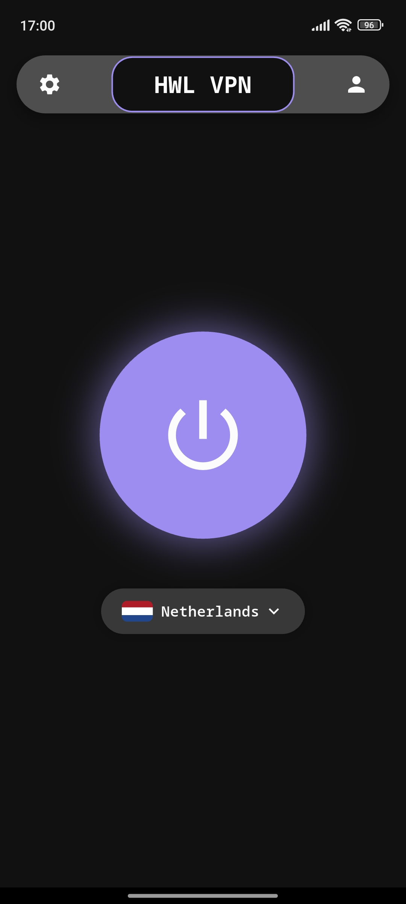
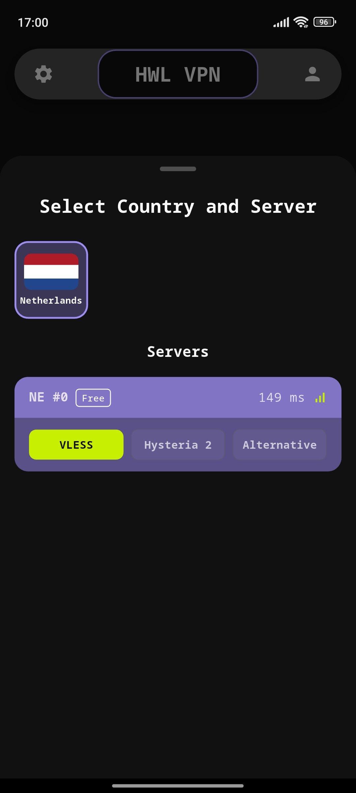
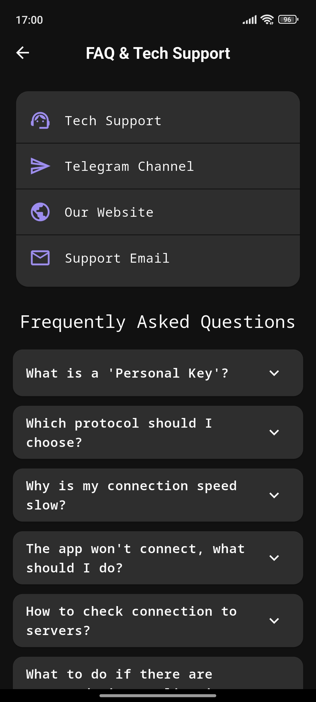

# HWL VPN

**HWL VPN** — кроссплатформенный VPN-клиент на **Flutter**, использующий ядро **Sing-box**.  
Это мой пет-проект, выросший из идеи для стартапа. Полноценное рабочее приложение с поддержкой современных протоколов.

---
🔗 **Backend:** [hwl-vpn-backend](https://github.com/finedk/hwl-vpn-backend)
---

## 📸 Скриншоты
<p align="center">
  
  
  
</p>

## ✨ Основные фишки
- **Протоколы:** VLESS (Reality), Hysteria 2, SSH.
- **Платформы:** Android, iOS, Windows, macOS.
- **Функционал:** 
  - Прокси для выбранных приложений (Split Tunneling).
  - Раздача VPN через локальный прокси (Mixed Inbound).
  - Выбор DNS (Google, Cloudflare, AdGuard).
  - Поддержка своих ключей подключения.

## 🛠 Стек
- **Frontend:** Flutter (State Management: Provider).
- **Core:** Sing-box.
- **Storage:** Secure Storage & Shared Preferences.

## 🚀 Как запустить
1. Убедитесь, что у вас установлен Flutter SDK.
2. **Ядро Sing-box:** Для работы приложения необходимо самостоятельно скомпилировать ядро `sing-box` под нужные платформы (Android, iOS, Windows, macOS) и разместить бинарные файлы в соответствующих папках проекта (библиотеки/исполняемые файлы).
3. Склонируйте репозиторий.
4. Выполните:
   ```bash
   flutter pub get
   flutter run
   ```

> **Note:** Приложение настроено на бэкенд `api.hinaworklab.tech`. Для использования со своим сервером нужно изменить конфиг в `lib/utils/constants.dart` или доработать логику получения серверов.

---
**License:** MIT
